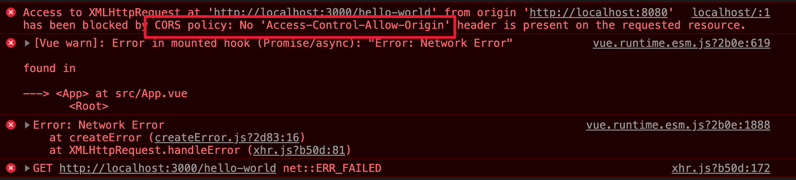

# Error from CORS

## Situation

* 前端跟後端要API資料，出現跨網域錯誤時 
* 基本上會如圖所示出現錯誤



* 資料來源：如何解決 Vue 開發環境下違反 Same-Origin Policy

## Solution

### If （Node環境自己開發）

#### 於`app.js`中加入 `cors` 套件

```javascript
let express = require('express');
let cors = require('cors');

let app = express().use(cors());
let port = 3000;

app.get('/hello-world', (req, res) => res.send('Hello World!'));

app.listen(port, () => console.log(`Node listening on port ${port}!`));
```

* 於第2行，將 `cors` 套件引入 
* 於第4行，`express()` 後，使用`cors ()`

