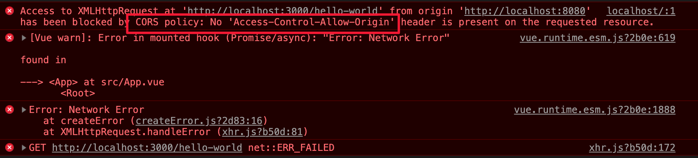

# Error from CORS

## Situation

* 前端跟後端要API資料，出現跨網域錯誤時 
* 基本上會如圖所示出現錯誤



* 資料來源：如何解決 Vue 開發環境下違反 Same-Origin Policy

## Solution

### If （Node環境自己開發）

#### 於`app.js`中加入 `cors` 套件

```javascript
let express = require('express');
let cors = require('cors');

let app = express().use(cors());
let port = 3000;

app.get('/hello-world', (req, res) => res.send('Hello World!'));

app.listen(port, () => console.log(`Node listening on port ${port}!`));
```

* 於第2行，將 `cors` 套件引入 
* 於第4行，`express()` 後，使用`cors ()`

### if（Node環境非自己開發）

#### 於Vue 中 加入 `vue.config.js`（這個 `js` 與 `package.json` 同層次）

#### 名稱 Reverse Proxy

```javascript
//vue.config.js
module.exports = {
  devServer: {
    proxy: {
      '/api': {
        target: 'http://localhost:3000',
        //taeget 是你起server的port
        pathRewrite: { '^/api': '' }
      }
    }
  },
};
```

```javascript
//App.vue
<script>
import axios from 'axios';

let mounted = async () => {
  let res = await axios.get('/api/hello-world');
  //原本為 [/hello-world] 改成 [/api/hello-world] 後
  //reverse proxy 會變成 http://localhost:3000/hello-world
  //所以可以避免掉 Same-Origin Policy
  console.log(res.data);
};

export default {
  name: 'app',
  mounted,
}
</script>
```

