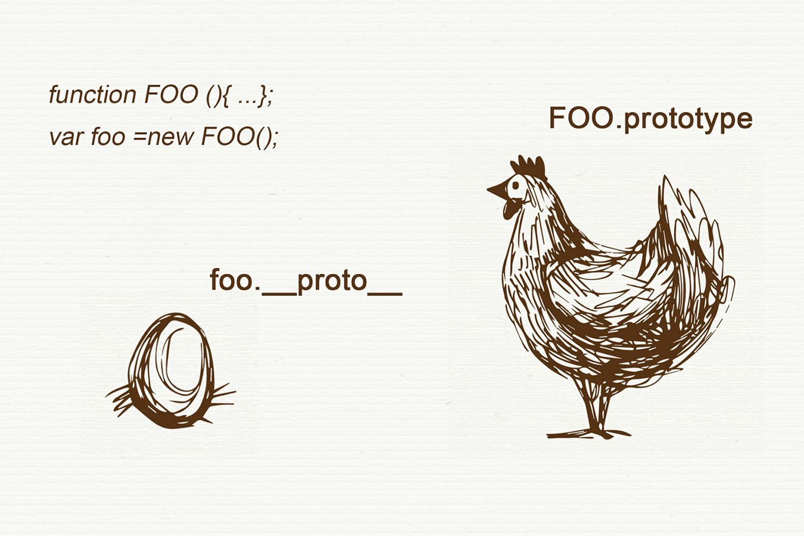

# TypeOf And InstanceOf

本篇介紹關於`TypeOf` 和 `InstanceOf`

資料來源：[Jartto's blog-JS基礎｜搞懂 typeof 和 instanceof](http://jartto.wang/2019/01/17/js-typeof/)

## Both：


能避免程式碼異常，為一種較嚴謹的處理方式。


## TypeOf：

* 用於判斷參數是什麼類型的方法。

```javascript
console.log(typeof 123); //number
console.log(typeof 'jartto'); //string
console.log(typeof !!'0'); //boolean
console.log(typeof new Function()); //function
console.log(typeof name); //undefined
```

* 但也要注意暫時性死區的問題

```javascript
console.log(typeof x);
let x;
```


較適用於基本類型的數據



不適用於物件、陣列、null 的判斷


## InstanceOf：

* `instanceof` 用來判斷 A 是否為 B 的實例，表達式為 `A instanceof B`，如果「_**是**_」返 回`true`，_**否**_則返回`false`。 
* 有點_**A是不是B**_的概念。但是是物件、陣列型的。

```javascript
[] instanceof  Array ; //true
 ({}) instanceof  Object ; //true 
new  Date () instanceof  Date ; //true
```

## 擴展：

#### 分析 \[ \]、Array、Obj 的關係（或者說順序）

1. 從`instanceof` 
2. 先判斷出 `[].__proto__` 指向 `Array.prototype` 
3. 再來判斷 `Array.prototype.__proto__`又指向`Obj.prototype` 
4. 最終判斷 `Obj.prototype.__proto__`指向了`null` 
5. 原型鏈結束。


所以你應該會發現，各自物件皆有各自的`__proto__`，而自己的`__proto__`，又指向上層的`prototype`


## 圖示說明-1：

資料來源：[\_\_proto\_\_ Vs. prototype in JS](https://stackoverflow.com/questions/9959727/proto-vs-prototype-in-javascript)


1. `b.__proto__` 指向 `Foo.prototype` 
2. `Foo.prototype.__proto__` 指向 `Object.prototype`

## 圖示說明-2：

這邊說明`prototype`與`__proto__`的先後順序

資料來源：[JS必須知道的繼承prototype](https://medium.com/@peterchang_82818/javascripter-%E5%BF%85%E9%A0%88%E7%9F%A5%E9%81%93%E7%9A%84%E7%B9%BC%E6%89%BF%E5%9B%A0%E5%AD%90-prototype-prototype-proto-object-class-inheritace-nodejs-%E7%89%A9%E4%BB%B6-%E7%B9%BC%E6%89%BF-54102240a8b4)



1. `function FOO(){...}` 只會產出 `FOO.prototype` 
2. `var foo = new FOO();`  後就會產出 `foo.__proto__`


