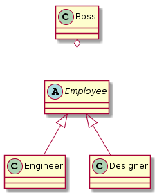

# OOP

## Glossary

OOP

Object-Oriented programming

物件導向

## Introduction

這篇主要介紹物件導向的設計基本原則（共有五類，簡稱_**SOLID**_）

資料來源：[物件導向程式設計基本原則-SOLID](https://skyyen999.gitbooks.io/-study-design-pattern-in-java/content/oodPrinciple.html)

## Single responsibility principle（SRP）

中文：單一職責原則

* 優點： 
  * 可讀性與可維護性提升 
    * 單一類別的負責度降低，因為要實現的職責都清晰的定義，大幅提升可讀與可維護性。 
  * 強健性提升 
    * 修改只會對同一個介面或類別有影響，這對擴展性和維護性都有幫助 
* 問題： 
  * 職責劃分。 
* 舉例： 
  * 在現實生活中我們希望馬克杯功能越多越好，可以裝熱可以裝冷。 
  * 在程式中，我們只期待這個馬克杯一個功能就好。 
* 程式碼參考：[it邦幫忙-Miles-SOLID之單一職責原則](https://ithelp.ithome.com.tw/articles/10191955)

## Open-Close principle（OCP）

中文：開放擴充，封閉修改原則。

* 開放擴充：新功能是用寫新的程式擴展出來的 
* 封閉修改：新功能不修改現有的程式碼 
* 優點： 
  * 降低修改風險。即修改時的觀念是新增程式碼，舊有程式因為沒修改，所以問題也比較小。 
* 舉例： 
  * 假設今天我們要因為要去雪地，要為車子換輪胎，這時只要將輪胎綁上雪鏈即可（開放擴充），並不用動到引擎的部分（封閉修改） 
* 程式碼參考：[it邦幫忙-Miles-SOLID之開關原則](https://ithelp.ithome.com.tw/articles/10192105)

## Liskov substitution principle（LSP）

中文：里氏替換

* 子類別必須要取代他的父類別。 
* 意思為父類別出現的地方，子類別就能代替他，而且程式不能出現問題。 
* 遵守原則要領： 
  * 子類別須完全實作父類別的方法 
  * 子類別可以擁有自己的屬性和方法 
  * 覆寫父類別的方法時，參數可以更寬鬆。 
  * 覆寫父類別的方法時，回傳結果要更儼謹。 
* 優點： 
  * 讓版本升級時，也可以有更好的兼容性。例如子類別修改，並不影響其他子類別，這是強健性的特質。 
* 舉例： 
  * 以洛克人的例子來說，他所擁有的基礎是射擊。 
  * 而從剪刀人拿到的削切剪刀是子能力（子類別），並且不影響原本功能。 
* 程式碼參考： 
  * [Code Paradise：里氏替換原則](http://glj8989332.blogspot.com/2018/03/design-pattern-liskov-substitution.html) 
  * [it邦幫忙-Miles-SOLID之里氏替換](https://ithelp.ithome.com.tw/articles/10192317)

## Interface segregation principle（ISP）

中文：介面隔離

* 文言：需要多型時，比較容易在類別實作上產生出對應的方法。 
* 白話：_**不應該強加**_上一些他們不使用（不會）的方法。

問題 Code：

```php
interface Dog
{
    public function eat();
    public function walk();
    public function handshake();
}

class 柴犬 implements Dog
{
    public function eat()
    {
        print '吃飯皇帝大！';
    }
    
    public function walk()
    {
        print '出來放風囉！';
    }
    
    public function handshake()
    {
        print '我會握手哦！';
    }
}

class 哈士奇 implements Dog
{
    public function eat()
    {
        print '吃飯皇帝大！';
    }
    
    public function walk()
    {
        print '出來放風囉！';
    }
    
    public function handshake()
    {
        throw new Exception('主人哩咧共蝦會');
    }
}
```

講解問題 Code：

1. 我們做出一個 Dog 的介面 
2. 然後實作出一隻柴犬（阿柴犬長大了，我們可以期待他會握手） 
3. 但是同樣實作出一隻哈士奇（哈士奇才剛出生，我們怎麼可以期待他會握手） 

解決方案：

```java
interface Dog
{
    public function eat();
    public function walk();
}

interface Show
{
    public function handshake();   
}
class 柴犬 implements Dog, Show{}
class 哈士奇 implements Dog{}
```

講解解決方案：

1. 柴犬實作了兩個類別 
2. 哈士奇實作了一個類別 
3. Solve

程式碼參考：[it邦幫忙-Miles-介面隔離](https://ithelp.ithome.com.tw/articles/10192464)

## Dependency Inversion Principle（DIP）

中文：依賴反轉

* 翻譯 
  * 文言：高階模組不應該依賴低階模組（細節），兩個都應該依賴在抽象概念上。抽象概念不依賴細節，而是細節依賴在抽象概念。 
  * 白話：話不能說太死，盡量講一些概念性的東西。 
* 舉例： 
  * 高階模組：BOSS 
  * 低階模組：F2E、Designer、PG、UI、UX 
  * 抽象概念：主管 

圖片解釋：



程式碼參考：[it邦幫忙-Miles-依賴反轉原則](https://ithelp.ithome.com.tw/articles/10192844)


