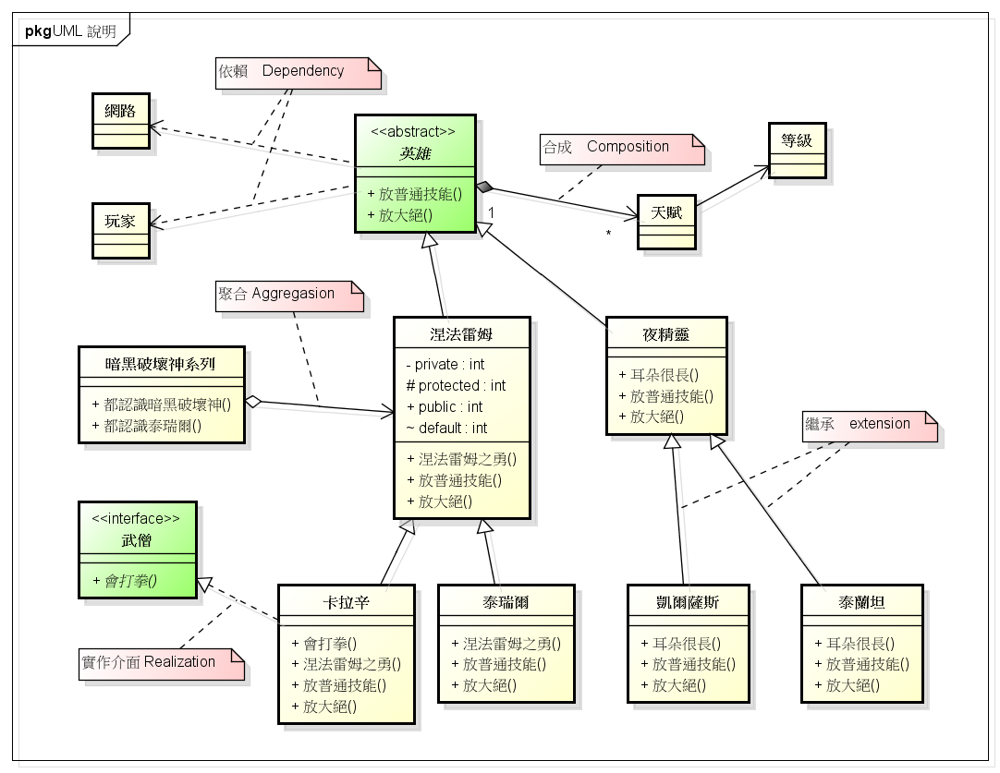

# UML

參考來源：[Class Diagram 與常見的箭頭們](http://ashkandi.herokuapp.com/blog/2015/09/14/uml-notes-01/)

### 空心菱形與實線

* 聚合關係 
* 東西可以單獨存在 
* 舉例：機場與飛機
  * 機場擁有飛機，但飛機並_**不是**_機場的一部分，兩者都可獨立

### 實心菱形與實線

* 組合/合成關係（has-a） 
* 物件相依，一個沒有就不行 
* 舉例：車子與引擎
  * 車子擁有引擎，引擎_**是**_車子的一部分

### 空心三角形與實線

* 繼承關係 
* 詳情請見OOP部分

### 箭頭與虛線

* 相依/依賴關係 
* 舉例：車子與加油站
  * 加油站必須知道車子的一些資訊

### 箭頭與實線

* 關聯關係

### 空心三角形與虛線

* 實現關係

