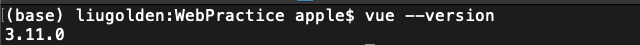
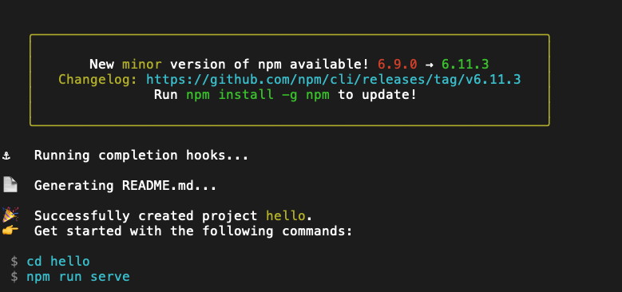
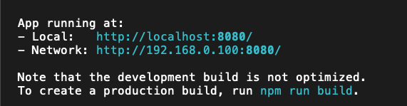
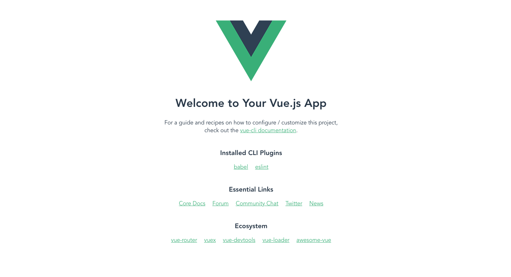

# Vue CLI Install

資料來源：[Vue一下 24日：CLI 3.0安裝](https://ithelp.ithome.com.tw/articles/10208548?sc=iThelpR)

## 安裝流程

### 基礎

* 請先安裝好 _**node.js**_ 
  * 傳送門：[Node.js Download](https://nodejs.org/zh-cn/download/) 
* `npm install -g @vue/cli` 
* `vue --version`

* 注意以上三個一定都要成功，你之後就會很順了 

### 開始建立專案

* vue create hello 
* 你可以選擇你想要的 `Babel / Eslint`  or  一些選配 
* 再來選擇 `yarn` or `npm` 
* 按完後，理論上會出現這個畫面

* 照上面寫的 `cd hello`   `npm run serve` 
* 會出現如下畫面

* 點開後，就會變成

* 恭喜完成最初 Vue CLI 安裝

