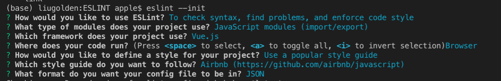

# ESLint And Prettier

## Def.

* _**ESLint**_：程式碼檢查工具，包含排版風格與潛在問題。（比較偏程式端，例如要不要`console.log`） 
* _**Prettier**_：支援多種語言的格式化工具（自動儲存，可以把分號和單引號自動修正） 
* 資料來源：[it邦幫忙-TYSON](https://ithelp.ithome.com.tw/articles/10205684)、[WanCW：Prettier+ESLint](https://medium.com/@wancw/%E7%AD%86%E8%A8%98-prettier-eslint-9e50d36d310f)

## ESLint：

### Install：

```bash
sudo npm install -g eslint
```

```bash
npm install eslint --save-dev
```

```bash
eslint --init
```

然後應該會出現像下面的一些問題。（白色是問題，藍綠色是我所選擇）



## Prettier：

### Install：

```bash
npm i prettier-eslint --save-dev 
```

## How To Use：

### ESLint

1. 基本上都完成後會出現一個 _**.eslintrc.json**_ 的檔案 
2. 看到裡面有一行 _**rules**_，你可以去設定一些，你所想要的程式碼風格。

### Prettier

1. 增加 _**`.vscode`**_ 檔案夾  
2. 裡面加入 _**`settings.json`**_檔案

```javascript
//setting.json
{
  "editor.formatOnSave": true,
  "prettier.singleQuote": true,
  "prettier.semi": false,
  "prettier.printWidth": 120,
  "prettier.trailingComma": "es5",
  "prettier.tabWidth": 4
}
//formatOnSave：儲存時自動格式化（這行是我覺得最重要，一定要打的功能）
//singleQuote：使用單引號
//semi：結束時自動加分號
//printWidth：行寬
//trailingComma：尾隨逗號（意思是說，一個物件的最後一個是否要逗號）
//tabWidth：縮排空幾格
```

## Test

1. 簡單的增加一個 `ex.js`

```javascript
//ex.js
const ex="1"

//手動儲存後，程式碼自動被修改為
const ex = '1';
```

## Suggestion


Use _**VSCode**_



Install EXTENSIONS：_**ESLint**_、_**Prettier**_


