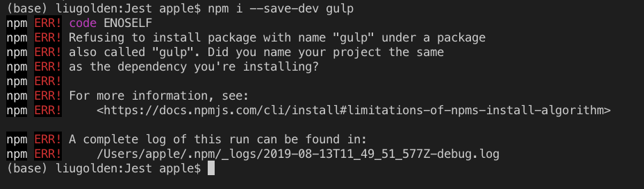
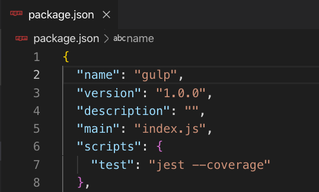

# 安裝常見錯誤-1 重複命名

背景：在你已經 `npm init` 後，要安裝套件時（通常資料夾已經有一個 `Package.json` 了）

假設：你要安裝 `Gulp` 套件

```text
npm i --save-dev gulp
```

## 發生狀況：



## 原因：

`Package.json` 重複命名



## 解決方法：

將`Package.json` 的 `name` 改為其他名字。

EX：GulpTester


