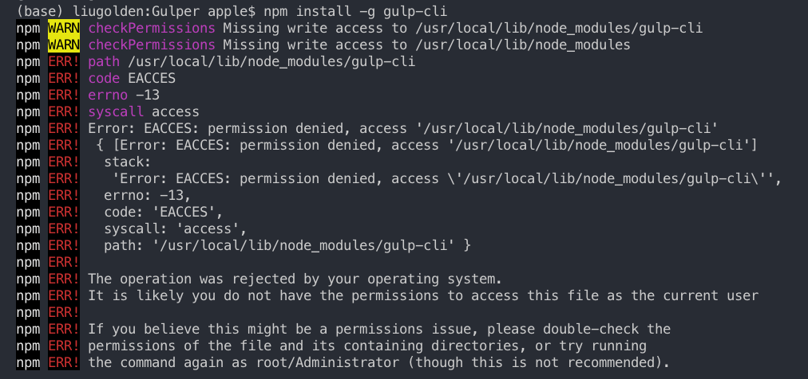

# 安裝常見錯誤-2 權限不足

背景：在你已經 `npm init` 後，要安裝套件時（通常資料夾已經有一個 `Package.json` 了）

假設：你要安裝 `Gulp` 套件（並且使用全域安裝）

```text
npm install -g gulp-cli
```

## 發生狀況：



## 原因：

`npm install` 時，權限不足

## 解決方法：

```text
sudo npm install -g gulp-cli
```

